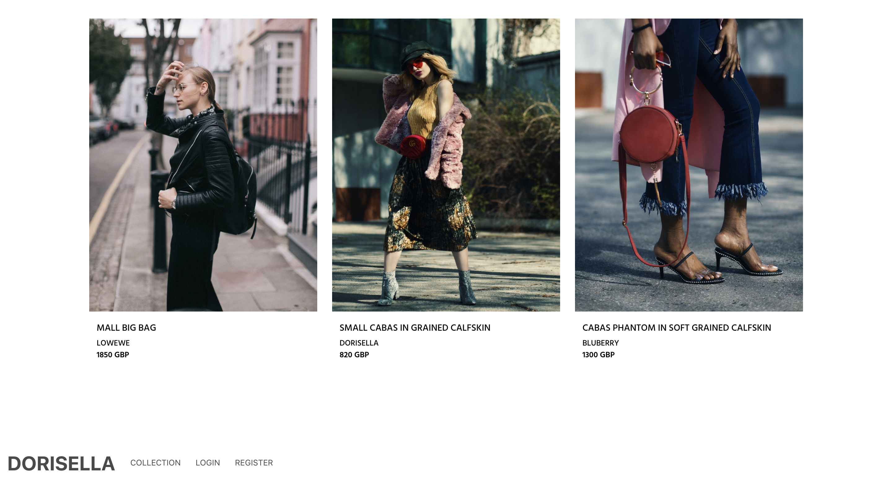
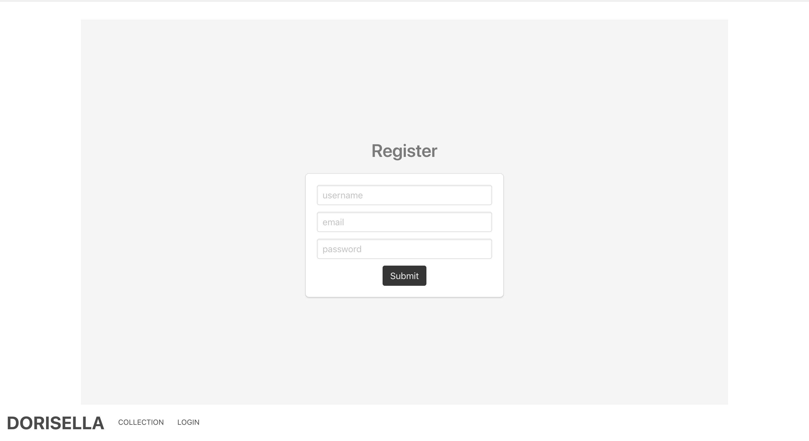
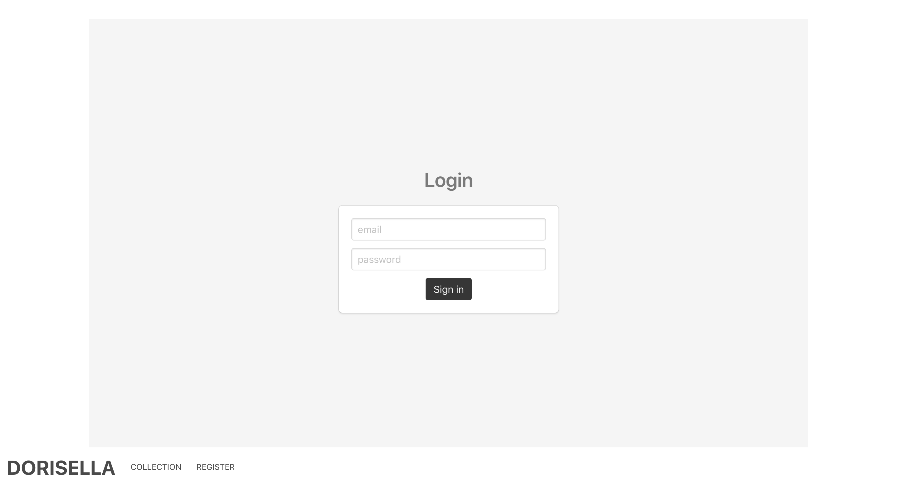
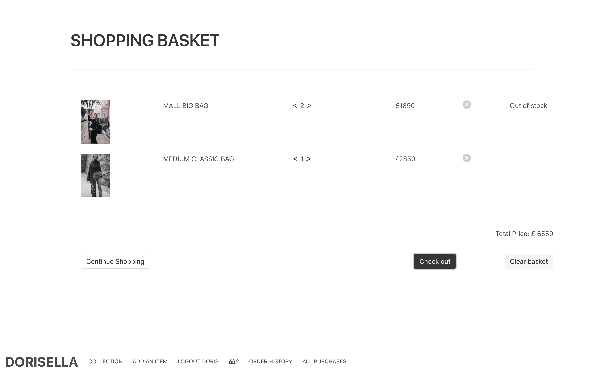
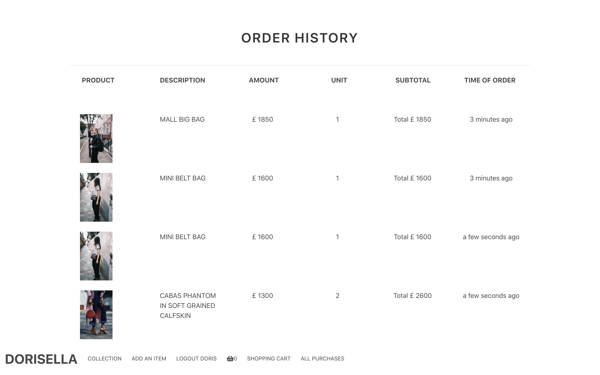
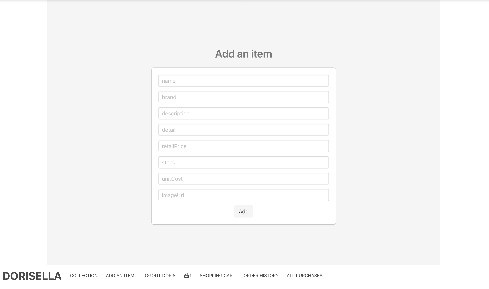
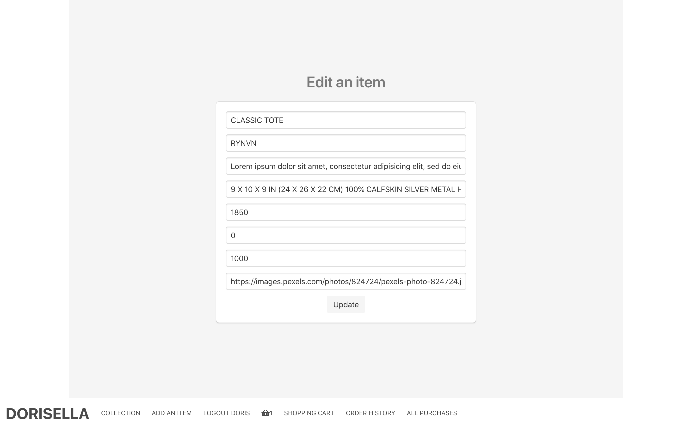

# General Assembly WDI Project 4: Dorisella

[Heroku Pages](https://dorisella.herokuapp.com/)

[GitHub Repo](https://github.com/huangfuin1101/wdi-project-four-dorisella)


## Home page


## Collection


## Register


## Login


## Buy a bag


## Basket


## Order history


## Add an item


## Edit an item


## All purchase history


## Technologies Used

* Git
* GitHub
* Heroku
* JavaScript (ECMAScript 6)
* Node.js
* express: v4.16.3
* MongoDB
* mongoose: v5.1.1
* body-parser: v1.18.3
* method-override: v3.5.0
* bcrypt: v2.0.1
* atob: v2.1.1
* jsonwebtoken: v8.2.1
* axios: v0.18.0
* react: v16.3.2
* react-dom: v16.3.2
* react-router-dom: v4.2.2
* babel-plugin-transform-class-properties: v6.24.1
* babel-plugin-transform-object-rest-spread: v6.26.0
* moment: v2.22.2
* chai: v4.1.2
* mocha: v5.2.0
* enzyme: v3.3.0
* enzyme-adapter-react-16: v1.1.1
* sinon: v5.0.7
* CSS3 with animation
* Bulma: v0.7.1
* Sass
* Google Fonts
* Favicon
* Fontawesome
* Adobe XD CC
* Trello


## Approach Taken

### Wireframes

### Brief


#### Server-side


#### Client-side


### Featured Piece of Code no.1
```

```
### Featured Piece of Code no.2

```


```
### Featured Piece of Code no.3

```
}
```

### Styling


### Wins and Blockers


### Future Features
