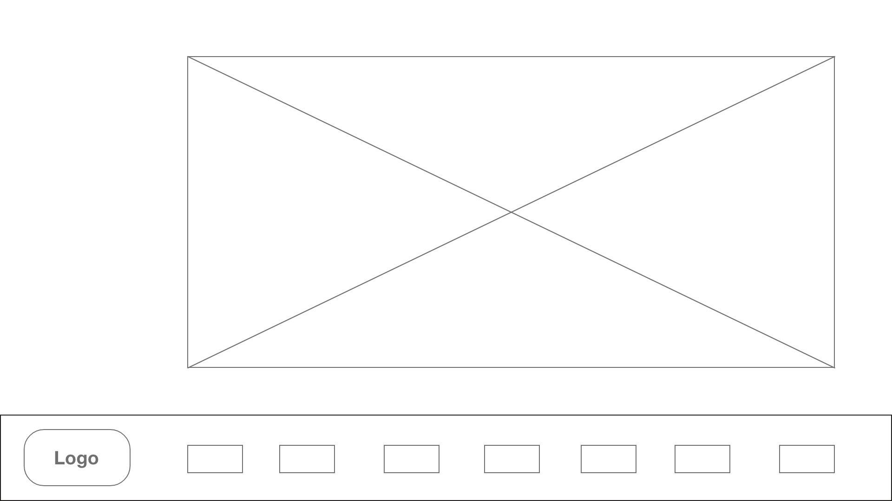
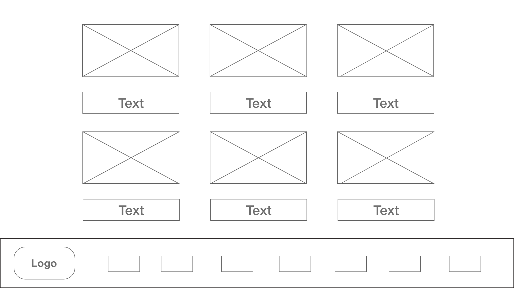
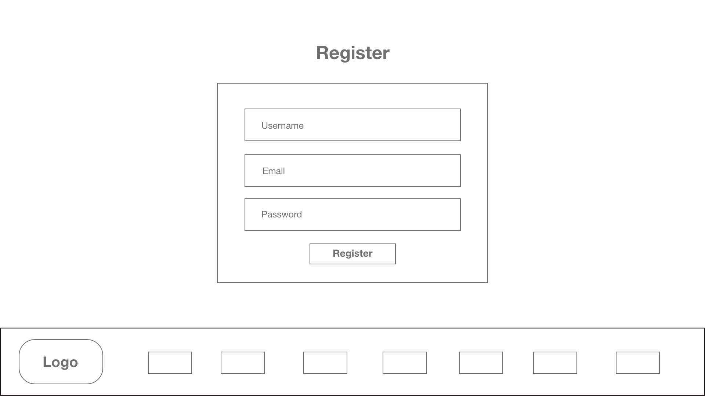
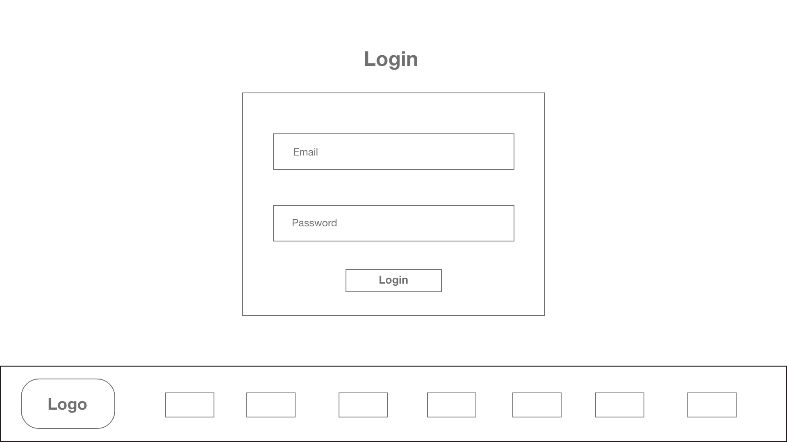
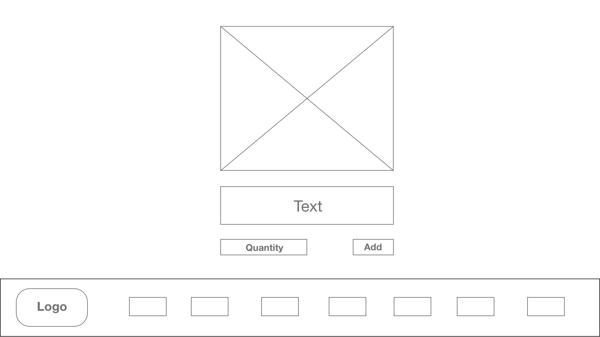
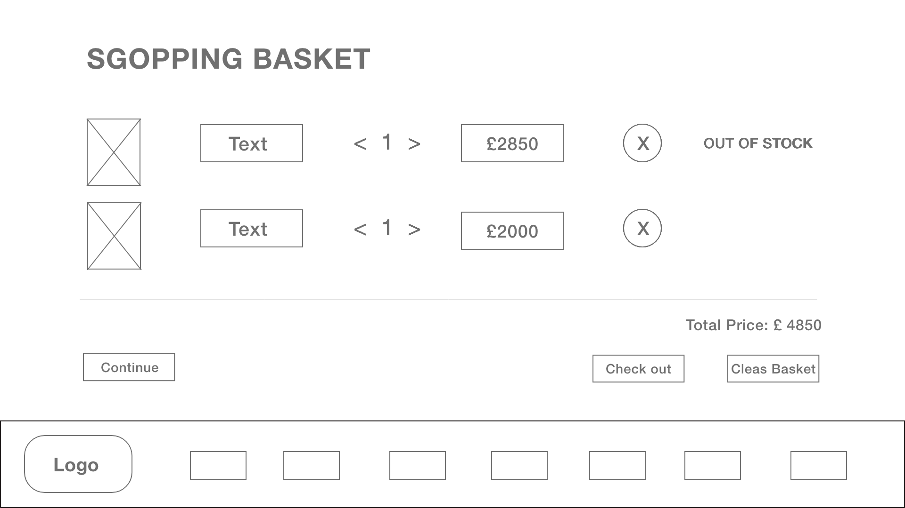
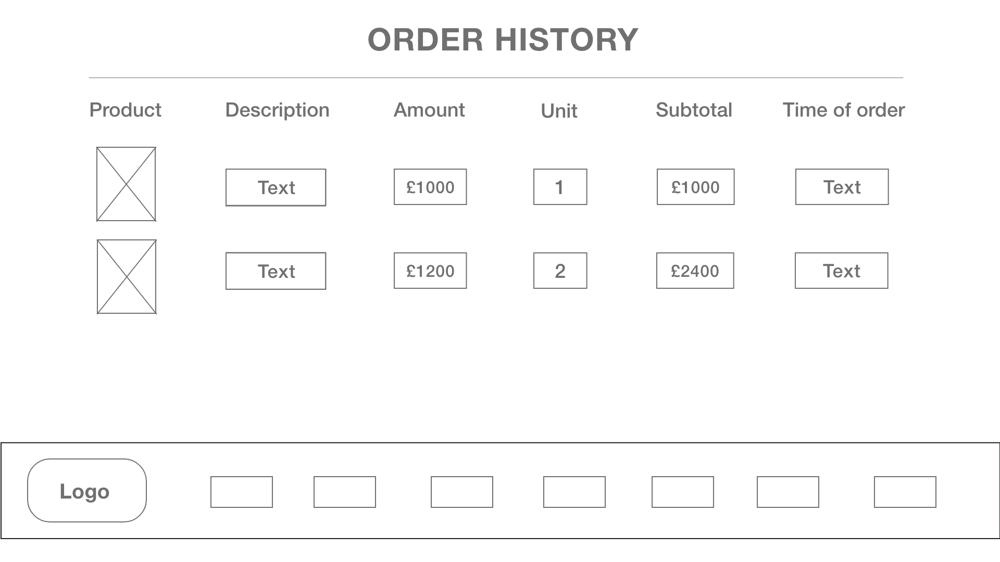

# General Assembly WDI Project 4: Dorisella

[Heroku Pages](https://dorisella.herokuapp.com/)

[GitHub Repo](https://github.com/huangfuin1101/wdi-project-four-dorisella)


## Home Page


## Collection (Bag Index)


## Register


## Login


## Buy a Bag (Bag Show)


## Basket


## Order History


## Add an Item


## Edit an Item


## All Purchase History


---

## Project Brief

* Build a full-stack application by making your own backend and your own front-end
* Use an Express API to serve your data from a Mongo database
* Consume your API with a separate front-end built with React
* Be a complete product which most likely means multiple relationships and CRUD functionality for at least a couple of models
* Implement thoughtful user stories/wireframes that are significant enough to help you know which features are core MVP and which you can cut
* Have a visually impressive design to kick your portfolio up a notch and have something to wow future clients & employers. ALLOW time for this.
* Be deployed online so it's publicly accessible.
* Have automated tests for at least one RESTful resource on the back-end, and at least one classical and one functional component on the front-end. Improve your employability by demonstrating a good understanding of testing principals.

## Technologies Used

* Git
* GitHub
* Heroku
* JavaScript (ECMAScript 6)
* Node.js
* express: v4.16.3
* MongoDB
* mongoose: v5.1.1
* body-parser: v1.18.3
* method-override: v3.5.0
* bcrypt: v2.0.1
* atob: v2.1.1
* jsonwebtoken: v8.2.1
* axios: v0.18.0
* react: v16.3.2
* react-dom: v16.3.2
* react-router-dom: v4.2.2
* babel-plugin-transform-class-properties: v6.24.1
* babel-plugin-transform-object-rest-spread: v6.26.0
* moment: v2.22.2
* chai: v4.1.2
* mocha: v5.2.0
* enzyme: v3.3.0
* enzyme-adapter-react-16: v1.1.1
* sinon: v5.0.7
* CSS3 with animation
* Bulma: v0.7.1
* Sass
* Google Fonts
* Favicon
* Fontawesome
* Adobe XD CC
* Trello

## Approach Taken

### Wireframes
The wireframes are made by Adobe XD.

#### Home


#### Collection (Bag Index)


#### Register


#### Login


#### Buy a bag (Bag Show)


#### Basket


#### Order history



## Functionality
I used Trello to organise this project.


### Featured Piece of Code no.1
```
purchaseSchema.pre('validate', function(next){
  this.populate('bag', () => {
    const enoughStock = this.bag.stock >= this.unitQuantity;
    // console.log('purchasing',this.bag._id, 'enough stock?', enoughStock);
    if(!enoughStock){
      this.invalidate(this.bag._id.toString(), 'not enough stock');
      console.log('purchasing',this, 'enough stock?', enoughStock);
    }
    next();
  });
});

purchaseSchema.pre('save', function(next){
  this.populate('bag', () => {
    this.bag.stock -= this.unitQuantity;
    this.bag.save(() => next());
  });
});

```
### Featured Piece of Code no.2

```
export function checkout() {
  axios.post('/api/checkout', getBasket(), {headers: {
    Authorization: `Bearer ${getToken()}`}})
    .then(() => {
      createBasket();
      createFlashMessage('Thank you for purchase');
      this.props.history.push('/purchases');
    })
    .catch((error) => {
      console.log('outOfStock', error.response.data.outOfStock);
      this.setState({ outOfStock: error.response.data.outOfStock });
    });
}

<div className="column is-2 has-text-centered">
{this.state.outOfStock.includes(item._id) && <p>Out of stock</p>}
</div>
```
### Featured Piece of Code no.3

```

```

### Styling


### Wins and Blockers


### Future Features
There are some features I would like to add in the future:

* Improve responsive design.
